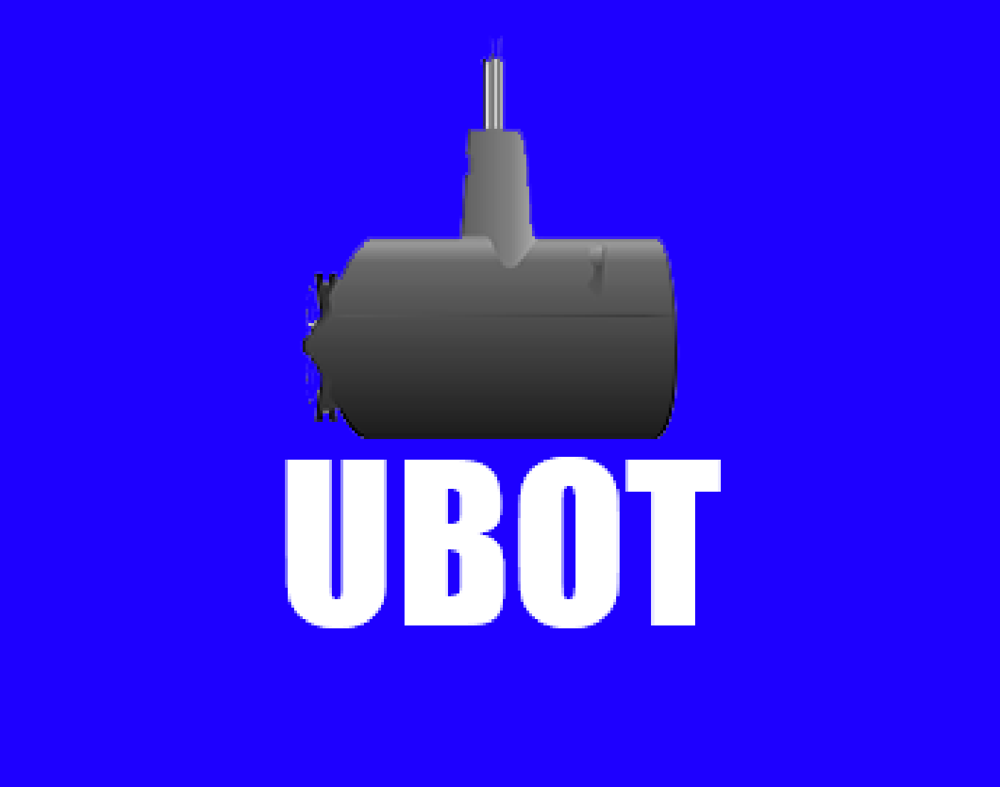

<p align="center">
    
</p>

---
### Table of contents
- [Idea](#idea)
- [Compiling from source](#compiling-from-source)
- [License](#license)
--- 

### Idea
**DESCRIPTION OF YOUR BOT**:
Utils Bot. UBOT. User discretion advised. U-Boot is the German word for Submarine.
---

### Compiling from source

Run open a terminal / cmd and run:
###### Clone the repository
```shell
git clone https://github.com/<github username>/<repository name>.git
```

###### Move inside the repository
```shell
cd <repository name>/bot
```
###### Use the Golang tool to build the code
```shell
go build -o bot
```
###### Execute the code
```shell
./bot -t <bot token>
```

---

### License
This project is under the [MIT License](LICENSE)
